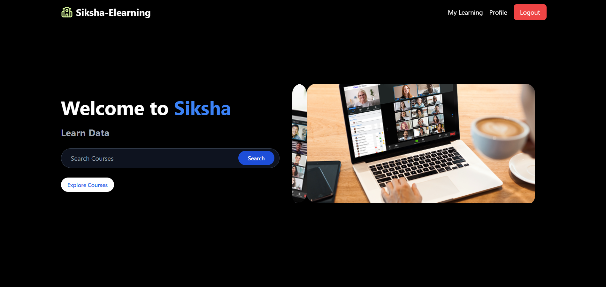

# E-Learning Platform (MERN Stack)

## 📚 Project Overview

This project is a full-featured **E-Learning Platform** built using the **MERN stack (MongoDB, Express, React, Node.js)**. It is designed to provide a seamless learning experience for students and efficient course management for admins. It includes dual role-based authentication (Admin & Student), course and lecture management, secure payments with **Stripe**, media storage via **Cloudinary**, and modern state management using **Redux Toolkit (RTK Query)**.

The UI is styled with **shadcn/ui** and **lucide-react** for clean and modern aesthetics.

---

## ✨ Features

### 👨‍🎓 For Students

* Register/Login securely
* Browse available courses
* View detailed course pages
* Enroll and pay for courses using Stripe
* Access "My Learning" dashboard for enrolled courses
* Watch video lectures
* View and update profile

### 🧑‍💼 For Admins

* Login securely
* Add new courses with image and video support
* Add lectures to courses
* View and manage all users and courses
* Cloudinary integration for media storage

### 🛠️ Technologies Used

* **Frontend:** React, Redux Toolkit, RTK Query, Shadcn UI, Lucide React
* **Backend:** Node.js, Express.js
* **Database:** MongoDB
* **Authentication:** JWT-based role authentication
* **Payments:** Stripe integration
* **Media Uploads:** Cloudinary for image and video storage

---

## 🖼️ Screenshots (Add your images in the placeholders)

### 1. Login & Register Page


### 2. Student Dashboard: Homepage




### 3. Course Listing Page


### 4. Course Details Page


### 5. Payment Page


### 6. Payment Success Page


### 7. My Learning Page (Student)


### 8. Profile Page (Student)


### 9. Filter Page (Student)


### 10. Admin Dashboard


### 11. Add Course Page (Admin)


### 12. Add Lecture to Course (Admin)


### 13. Lecture Detail Page (Admin)


### 14. CourseCard (Admin)


---

## 🚀 Getting Started

### Prerequisites

* Node.js & npm
* MongoDB running locally or via Atlas
* Stripe Developer Account
* Cloudinary Account

### Backend Setup

```bash
cd backend
npm install
npm run dev
```

### Frontend Setup

```bash
cd frontend
npm install
npm run dev
```

### Environment Variables

Create `.env` files in both frontend and backend with the following variables:

#### Backend `.env`

```
PORT=3000
MONGO_URI=your_mongo_connection_string
JWT_SECRET=your_jwt_secret
CLOUDINARY_CLOUD_NAME=your_cloud_name
CLOUDINARY_API_KEY=your_api_key
CLOUDINARY_API_SECRET=your_api_secret
STRIPE_SECRET_KEY=your_stripe_secret_key
FRONTEND_URL=https://your-frontend-url.com
```

#### Frontend `.env`

```
VITE_API_URL=https://your-backend-url.com/api/v1
VITE_STRIPE_PUBLISHABLE_KEY=your_stripe_publishable_key
```

### 🌐 Deployment Info

## For student
Register Yourself and then login

## For admin
username-ashu@123.gmail.com
password-123


### Frontend

* Deployed using: **Vercel 
* Live site: ``


---

## 🙌 Contributing

Pull requests are welcome. For major changes, please open an issue first to discuss what you would like to change.

---


